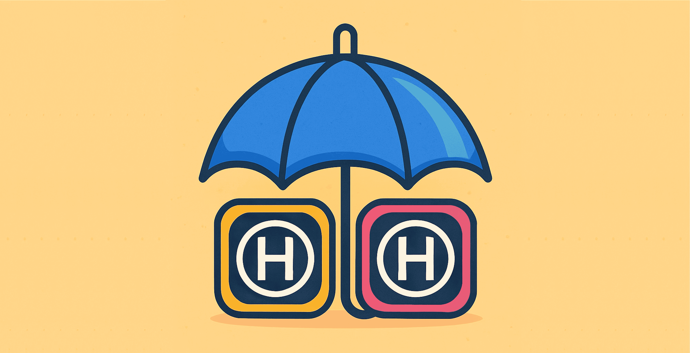

### Umbrella

This project is an XCFramework acting as the "Umbrella", encompassing all of the code that we share between the [Android](https://github.com/HedvigInsurance/android) and the [iOS](https://github.com/HedvigInsurance/ugglan) projects.
The shared code lives inside the Android repository, which in there is exists as normal gradle projects that are indivdually used by other parts of the app that require that functionality.
For iOS, one big XCFramework is exposed, to combat the issues with duplication of code when importing each project individually. This is better described [here](https://www.jetbrains.com/help/kotlin-multiplatform-dev/multiplatform-project-configuration.html#several-shared-modules)

The CI action that makes new releases in this repository lives inside the Android repository https://github.com/HedvigInsurance/android/blob/develop/.github/workflows/umbrella.yml 

The resulting artifact is named HedvigShared.xcframework.zip and is included in each release which is timestamped at the time of its creation